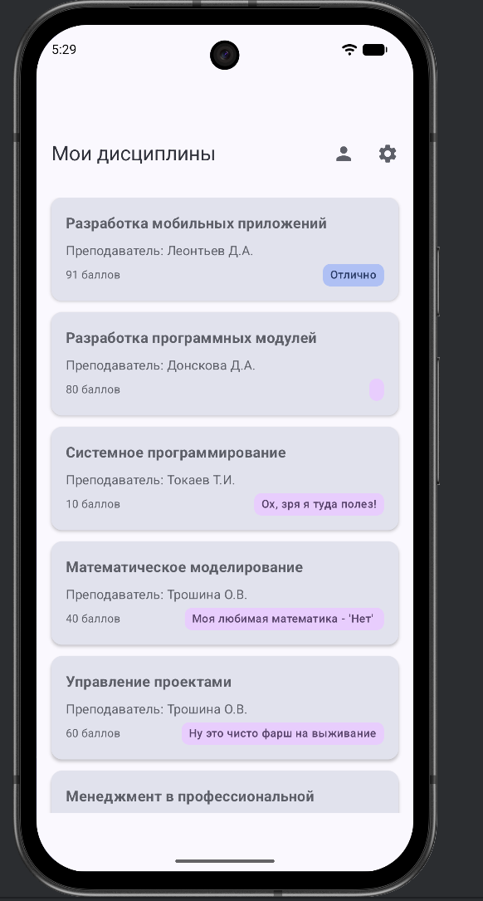
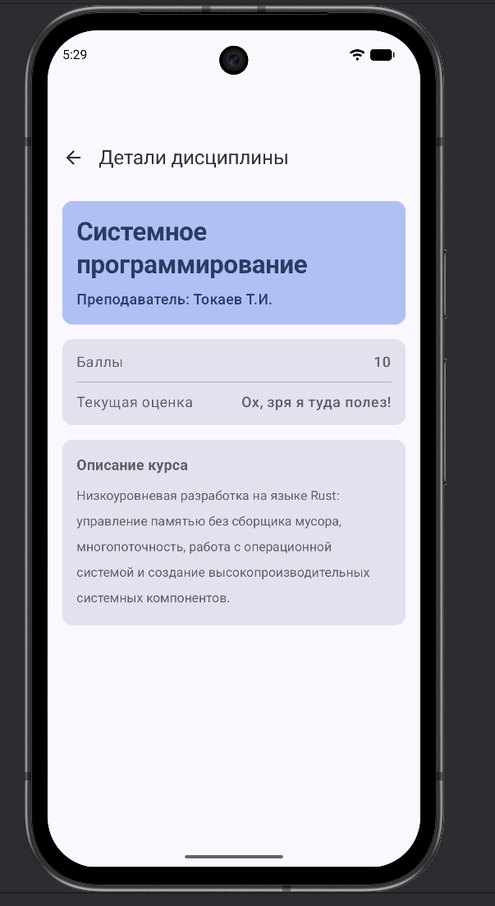
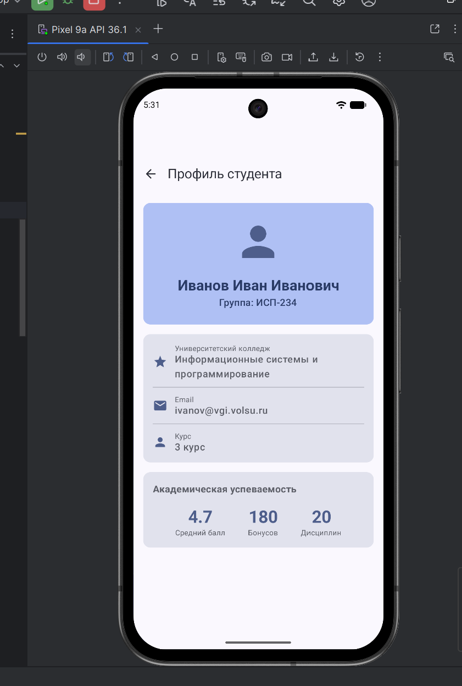
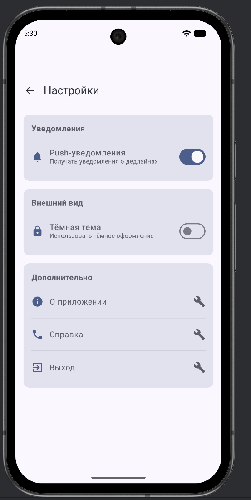

Вот готовый шаблон README.md и ответы на контрольные вопросы:

## 📄 README.md
# Student Planner

## Описание
Student Planner - это приложение для управления учебными дисциплинами на Android. Приложение позволяет просматривать список предметов, получать подробную информацию о каждом из них, включая преподавателя, количество баллов и текущую оценку. Реализован современный интерфейс с использованием Material Design 3.

## Реализованные экраны
- **Home Screen** - главный экран со списком всех дисциплин в виде карточек
- **Details Screen** - экран детальной информации о дисциплине с параметром subjectId
- **Profile Screen** - экран профиля студента
- **Settings Screen** - экран настроек приложения

## Используемые технологии
- **Kotlin** - основной язык программирования
- **Jetpack Compose** - современный toolkit для создания UI
- **Navigation Compose** - компонент для навигации между экранами
- **Material Design 3** - дизайн-система
- **Sealed Classes** - для типобезопасной навигации

## Схема навигации

                    ┌─────────────┐
                    │ Home Screen │
                    │  (Старт)    │
                    └──────┬──────┘
                           │
         ┌─────────────────┼─────────────────┐
         │                 │                 │
         ▼                 ▼                 ▼
┌─────────────┐    ┌─────────────┐   ┌─────────────┐
│Details Screen│   │Profile Screen│   │Settings Screen│
│ subjectId   │    │             │   │             │
└─────────────┘    └─────────────┘   └─────────────┘
**Навигация:**
- Home → Details (с передачей subjectId)
- Home → Profile
- Home → Settings
- Все экраны могут возвращаться назад (popBackStack)

## Скриншоты
### Главный экран


### Экран деталей


### Профиль


### Настройки


---

## 📝 Ответы на контрольные вопросы

### 1. Что такое NavController и для чего он используется?

**NavController** - это главный управляющий класс навигации в Jetpack Compose. Его роль можно сравнить с диспетчером, который:
- Отслеживает текущий экран (destination)
- Управляет переходом между экранами (navigate)
- Контролирует стек навигации (back stack)
- Обрабатывает возврат назад (popBackStack)

**Почему важно использовать rememberNavController():**
```kotlin
// ПРАВИЛЬНО:
val navController = rememberNavController()

// НЕПРАВИЛЬНО:
val navController = NavController() // Создастся новый при каждой рекомпозиции!
```

`rememberNavController()` создаёт NavController **один раз** и сохраняет его между рекомпозициями. Если создавать его напрямую, при каждом обновлении UI будет создаваться новый контроллер, что приведёт к:
- Потере состояния навигации
- Сбросу back stack
- Непредсказуемому поведению приложения

---

### 2. Как передать параметр в маршрут навигации?

**Процесс передачи параметра:**

**Шаг 1: Определить маршрут с placeholder**
```kotlin
sealed class Screen(val route: String) {
    object Details : Screen("details/{subjectId}") {
        fun createRoute(subjectId: String) = "details/$subjectId"
    }
}
```

**Шаг 2: Зарегистрировать аргумент в NavHost**
```kotlin
composable(
    route = Screen.Details.route,
    arguments = listOf(
        navArgument("subjectId") {
            type = NavType.StringType
        }
    )
) { backStackEntry ->
    // Извлечение параметра
}
```

**Шаг 3: Извлечь параметр на экране**
```kotlin
val subjectId = backStackEntry.arguments?.getString("subjectId") ?: ""
```

**Шаг 4: Выполнить навигацию с параметром**
```kotlin
navController.navigate(Screen.Details.createRoute("123"))
// Результат: переход на "details/123"
```

**Разница между обязательными и опциональными параметрами:**

| Обязательные параметры | Опциональные параметры |
|------------------------|------------------------|
| Указываются в маршруте: `"details/{subjectId}"` | Не указываются в маршруте |
| Без них навигация не сработает | Имеют значения по умолчанию |
| Извлекаются через `arguments?.getString()` | Передаются через `defaultArguments` |

**Пример опционального параметра:**
```kotlin
navArgument("theme") {
    type = NavType.StringType
    defaultValue = "light"  // Значение по умолчанию
    nullable = true
}
```

---

### 3. Зачем использовать sealed class для маршрутов?

**Преимущества sealed class:**

1. **Типобезопасность (Type Safety)**
```kotlin
// С sealed class - компилятор проверит все варианты:
when (screen) {
    is Screen.Home -> ...
    is Screen.Details -> ...
    is Screen.Profile -> ...
    is Screen.Settings -> ...
    // Компилятор знает ВСЕ возможные экраны!
}

// С обычными String - возможна ошибка:
val route = "hom" // Опечатка! Компилятор не заметит
```

2. **Централизованное управление**
   Все маршруты в одном месте - легко добавлять новые и поддерживать

3. **Автодополнение в IDE**
   При вводе `Screen.` IDE покажет все доступные экраны

4. **Невозможно создать несуществующий маршрут**
```kotlin
// С sealed class - так не получится:
Screen.NonExistent // Ошибка компиляции!

// Со String - возможно:
navController.navigate("wrong_route") // Скомпилируется, но упадёт runtime
```

**Пример ошибки, которую предотвращает sealed class:**

```kotlin
// Проблема со String:
val HOME = "home"
val HOM = "hom"  // Опечатка!

navController.navigate(HOM) // Скомпилируется, но экран не найдётся

// С sealed class:
navController.navigate(Screen.Home.route) // Всегда правильно
```

---

### 4. Что такое Back Stack и как им управлять?

**Back Stack** - это стек (структура данных LIFO - Last In, First Out), который хранит историю посещённых экранов.

**Схема back stack для последовательности Home → Profile → Settings:**

```
Шаг 1: Запуск приложения
┌─────────────┐
│    Home     │  ← Текущий экран
└─────────────┘

Шаг 2: Переход Home → Profile
┌─────────────┐
│   Profile   │  ← Текущий экран
├─────────────┤
│    Home     │
└─────────────┘

Шаг 3: Переход Profile → Settings
┌─────────────┐
│  Settings   │  ← Текущий экран
├─────────────┤
│   Profile   │
├─────────────┤
│    Home     │
└─────────────┘
```

**Что произойдёт при вызове popBackStack() на экране Settings?**

```kotlin
// На экране Settings:
navController.popBackStack()

Результат:
┌─────────────┐
│   Profile   │  ← Текущий экран (Settings удалён)
├─────────────┤
│    Home     │
└─────────────┘
```

- Экран **Settings** удаляется из стека
- Активным становится **Profile** (предыдущий экран)
- При повторном нажатии "Назад" вернётесь на **Home**

**Дополнительные методы управления:**
```kotlin
// Вернуться к Home и очистить всё выше
navController.popBackStack(Screen.Home.route, inclusive = false)

// Перейти и очистить стек (чтобы нельзя было вернуться)
navController.navigate(Screen.Home.route) {
    popUpTo(Screen.Home.route) { inclusive = true }
}
```

---

### 5. Как работает startDestination в NavHost?

**startDestination** - это начальный маршрут, который отображается при первом запуске приложения.

**Какой экран будет показан первым:**
```kotlin
NavHost(
    navController = navController,
    startDestination = Screen.Home.route  // ← Этот экран!
) {
    // ...
}
```

При запуске приложения **первым всегда показывается экран, указанный в startDestination** (в нашем случае - Home Screen со списком дисциплин).

**Можно ли изменить startDestination динамически?**

**Да, можно!** Примеры использования:

**Пример 1: Проверка авторизации**
```kotlin
@Composable
fun StudentPlannerNavHost(navController: NavHostController) {
    val isLoggedIn = checkIfUserLoggedIn() // Проверка в БД/SharedPreferences
    
    NavHost(
        navController = navController,
        startDestination = if (isLoggedIn) Screen.Home.route else Screen.Login.route
    ) {
        // ...
    }
}
```

**Пример 2: Onboarding при первом запуске**
```kotlin
val isFirstLaunch = remember { 
    preferences.getBoolean("isFirstLaunch", true) 
}

NavHost(
    navController = navController,
    startDestination = if (isFirstLaunch) Screen.Onboarding.route else Screen.Home.route
) {
    // ...
}
```

**Пример 3: Глубокие ссылки (Deep Links)**
```kotlin
// При запуске по ссылке вида: app://subjects/123
NavHost(
    navController = navController,
    startDestination = "details/123"  // Динамически из intent
)
```

**Важно:** После первого запуска startDestination обычно не меняется (если не перезапустить Activity). Для сложной логики лучше использовать условную навигацию внутри экранов.
